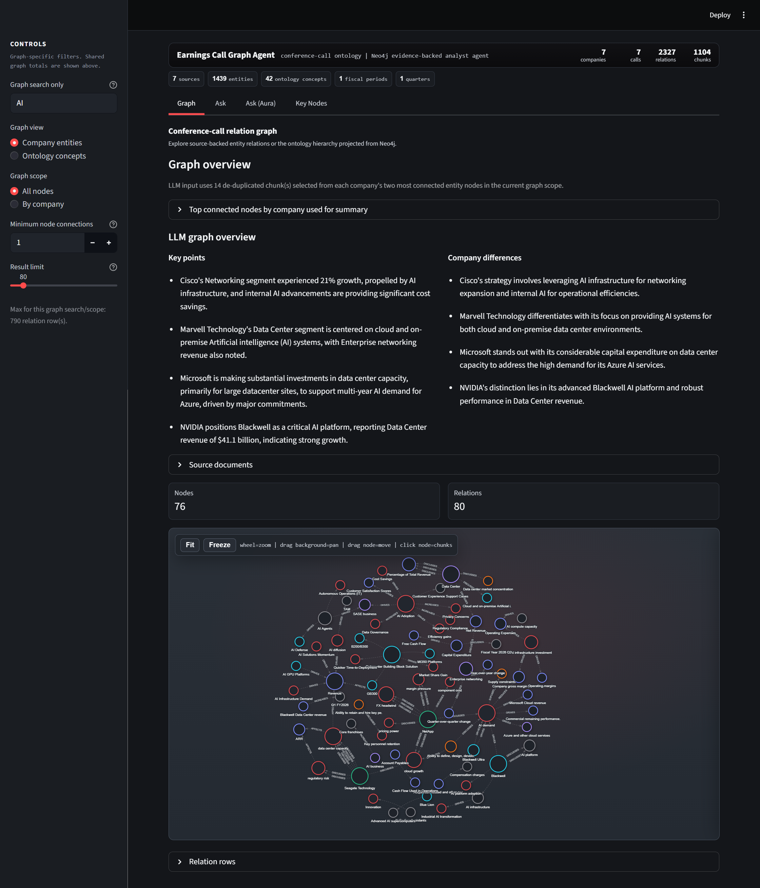
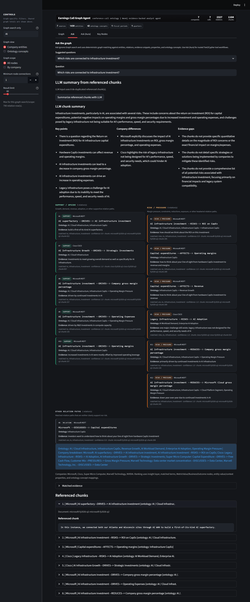
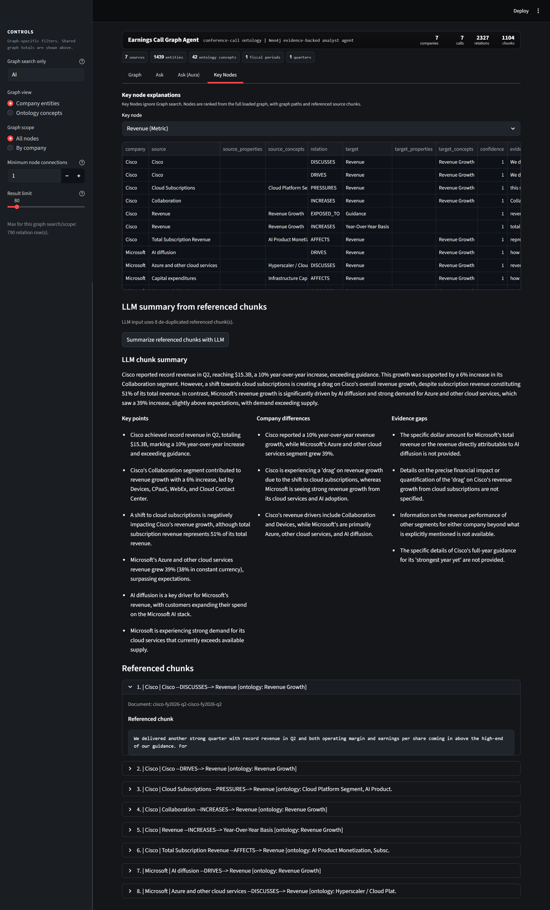

> [!IMPORTANT]
> Nothing in this repository constitutes investment, legal, tax, or accounting advice. Earnings Call Graph is a research aid for human review. It does not make investment recommendations or execute transactions.

# Earnings Call Graph Analyst

Earnings Call Graph is a Neo4j + Streamlit project for making AI companies' earnings-call materials easier to read, compare, and verify. It converts public transcripts and prepared remarks into a graph of companies, source documents, chunks, entities, relation facts, and ontology concepts.

The project is intentionally specialized for AI-related earnings-call questions. It is not a general-purpose transcript search app; it is built to help users trace how AI infrastructure demand, AI products, and AI supply-chain concepts show up in management commentary and connect to business outcomes.

In particular, the project is designed for questions like:

- Which companies are currently loaded in the earnings-call graph?
- What positive demand signals are companies reporting for AI infrastructure?
- How do products such as Blackwell, custom silicon, cloud infrastructure, networking, or CoWoS connect to business outcomes?
- Which graph paths and source evidence support each conclusion?

Instead of only retrieving transcript snippets, Earnings Call Graph exposes graph reasoning paths such as:

```text
AI Demand --DRIVES--> Cloud growth
Blackwell Ultra --DRIVES--> AI Demand
AI Demand --DRIVES--> Custom silicon
AI Infrastructure Solutions --DRIVES--> Product Revenue
```

## UI examples

### Graph exploration

The Graph tab combines search/company/ontology filters, connected-chunk LLM overview, and an interactive relation graph.



### Ask

The Ask tab performs deterministic graph question answering. It can summarize matched referenced chunks with an LLM, then shows relation cards split into **Support / upside** and **Risk / pressure** columns with explicit ontology mappings and source evidence.



### Ask (Aura)

The Ask (Aura) tab is a local tester for Aura-style graph tools: the user enters a question, the router selects the tool, and the app writes an answer from `Graph reasoning path` plus `Referenced chunk` rows.

.png>)

### Key Nodes

The Key Nodes tab ranks high-signal graph entities, shows selected-node relation evidence, and summarizes connected referenced chunks with an LLM.



## Demo scope

The current demo focuses on a curated 2026 fiscal-period set of AI infrastructure-related earnings-call materials from:

- Cisco (CSCO)
- Marvell Technology (MRVL)
- Microsoft (MSFT)
- NetApp (NTAP)
- NVIDIA (NVDA)
- Seagate Technology (STX)
- Super Micro Computer (SMCI)

This list is a demo dataset, not a hard-coded application limit. Earnings Call Graph reads companies from source manifests and from loaded Neo4j `Company` nodes, so users can add new companies by adding their own earnings-call Markdown or source-manifest entries.


## Why a graph fits

Earnings calls are narrative-heavy and inconsistent across companies. The same theme can appear as `Blackwell`, `Silicon One`, `Maia`, `custom silicon`, `CoWoS`, `Microsoft Cloud`, `data center switching`, `AI infrastructure revenue`, or `cloud AI growth`.

The graph preserves company-specific terms while connecting them through structured relation facts and ontology concepts:

```text
Company -> SourceDocument -> MarkdownChunk
MarkdownChunk <- SUPPORTED_BY - RelationFact
RelationFact -> FROM_ENTITY -> Entity
RelationFact -> TO_ENTITY -> Entity
Entity -> OntologyConcept
```

This makes cross-company comparison possible without losing the original source evidence.

## Repository contents

```text
app.py                          Streamlit entry point
src/earnings_call_graph/              Python package
src/earnings_call_graph/ui/           Streamlit graph UI
scripts/                        Utility scripts
data/ontology/                  Public ontology used for concept mapping
data/sources/*.example.json     URL-free example source manifest
docs/final_submission_report.md Final report and screenshots
tests/                          Test suite
```

Local/generated material is intentionally ignored:

```text
.env
exports/
data/source_cache/
data/sources/major_companies.json
.omx/
.venv/
```

## Setup

```powershell
python -m venv .venv
.\.venv\Scripts\Activate.ps1
pip install -e ".[dev]"
```

Create a local `.env` from the template:

```powershell
Copy-Item .env.example .env
```

Fill in your Neo4j Aura or local Neo4j settings, plus optional Gemini settings:

```env
NEO4J_URI=neo4j+s://your-instance.databases.neo4j.io
NEO4J_USERNAME=neo4j
NEO4J_PASSWORD=your_password
NEO4J_DATABASE=neo4j
GEMINI_API_KEY=your_gemini_key
GEMINI_MODEL=gemini-2.5-flash
```

## Run the Streamlit UI

```powershell
streamlit run app.py
```

The UI has four main tabs:

1. **Graph** - explore entity/relation paths and ontology-grouped graph views, with filters and an LLM graph overview from connected referenced chunks.
2. **Ask** - ask graph-backed questions using deterministic evidence matching, then optionally summarize matched referenced chunks with an LLM.
3. **Ask (Aura)** - test a local Neo4j Aura Agent-like workflow that mimics Aura graph-tool behavior with a LangGraph-style `router -> tool execution -> answer` orchestration pattern.
4. **Key Nodes** - inspect important entities and their source-backed relation paths, then summarize connected referenced chunks with an LLM.

## Data workflow

### Option A: use local normalized Markdown

Place normalized transcript Markdown files under:

```text
data/source_cache/markdown/
```

Then run:

```powershell
earnings-call-graph sync --input-dir data/source_cache/markdown --use-fixtures --reset
```

### Option B: use a private source manifest

Copy the URL-free example manifest:

```powershell
Copy-Item data/sources/major_companies.example.json data/sources/major_companies.json
```

Fill the private `source_url` values locally, then run:

```powershell
earnings-call-graph sync --reset
```

### Add another company

To add a new company, create or edit a private manifest entry with at least:

```json
{
  "filename": "new-company-fy2026-q1.md",
  "company": "New Company",
  "company_id": "new-company",
  "ticker": "NEW",
  "quarter": "FY2026 Q1",
  "source_url": "https://official-investor-relations-source.example/transcript.pdf"
}
```

Then either place a normalized Markdown file with the same `filename` under `data/source_cache/markdown/` and run with `--use-fixtures`, or provide an official `source_url` and let `sync` materialize the source. The Streamlit company picker and graph-backed questions use loaded `Company` nodes, so the new company appears after the graph is regenerated and loaded.

Useful variants:

```powershell
# Build/reuse graph JSON without touching Neo4j
earnings-call-graph sync --json-only

# Load already-generated graph JSON files only
earnings-call-graph load --reset

# Regenerate existing graph JSON files before loading
earnings-call-graph sync --force --reset

# Process fewer manifest entries
earnings-call-graph sync --limit 8 --reset
```

## Aura Agent demo

The Streamlit **Ask (Aura)** tab includes a local tester for Neo4j Aura
Agent-style graph tools. Aura's agent tool behavior is mimicked in the web app
with a LangGraph-style orchestration pattern: route the user question, execute
the selected graph tool, then write an answer from the returned rows. This lets
the same flow be tested locally before recreating it in Aura.

- `loaded_company_universe`: fixed Cypher-template tool that lists loaded
  companies.
- `frequent_entities`: fixed Cypher-template tool that ranks frequently
  mentioned non-company entities.
- `ai_positive_demand_by_company`: Text2Cypher tool for cross-company positive
  AI infrastructure demand signals.
- `ai_risks_constraints_by_company`: Text2Cypher tool for cross-company AI
  infrastructure risks, constraints, bottlenecks, and headwinds.
- `company_ai_deep_dive`: Text2Cypher tool for one company's AI, product, and
  data-center evidence paths.
- `product_category_evidence_map`: Text2Cypher tool for mapping a requested
  product category to company evidence.

The tester now works like an agent: enter a question, let the router choose the
best tool, then run it. The current UI does not expose manual tool override
controls. For Text2Cypher tools, the tester generates or selects a tool-specific
read-only Cypher query, validates it, runs it, and renders a source-grounded
answer focused on company, graph reasoning path, and referenced transcript
chunks.

## Tests

```powershell
python -m pytest -q
```
